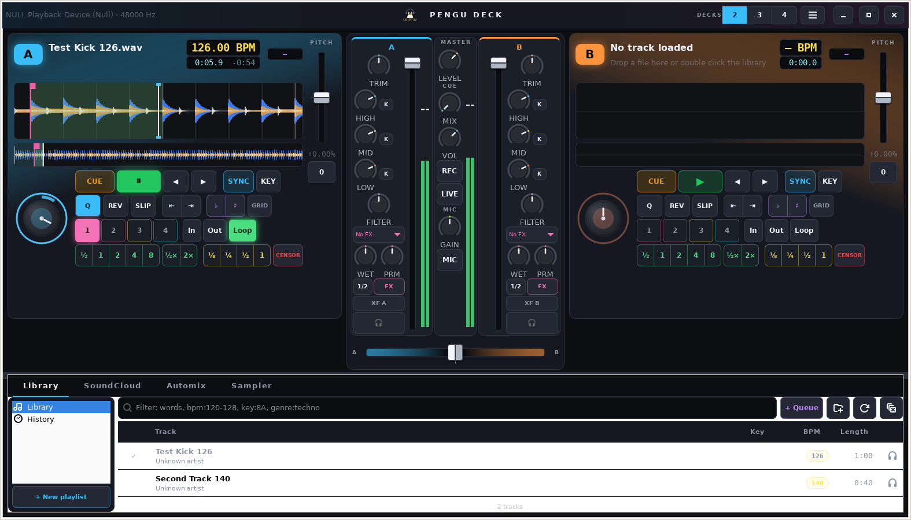

# Pengu Deck

DJ software for Linux with two to four decks. Plays anything FFmpeg can
decode from your music folders and streams tracks from SoundCloud
straight into a deck.



## Features

- 2–4 decks, switchable live without interrupting the music
- Three band coloured waveforms, scratchable zoomed view, track overview
- BPM and beat grid detection with grid editing and tap tempo
- Key detection (Camelot), key shift and keylock (Rubber Band)
- Sync, sync lock, quantize, beat jump, pitch range ±8/16/50/100 %
- Hot cues, beat loops, loop roll, slip, censor, reverse
- Four channel mixer: trim, 3 band EQ with kills, filter, crossfader
  assignment and curves, master limiter, auto gain
- Effects unit per channel: echo, reverb, flanger, phaser, bit crusher,
  trance gate, synced to the deck tempo
- Eight pad sampler
- Automix with transitions sized from the tracks (see below)
- Library with playlists, history, preview deck, M3U and set list
  export, search tokens `bpm:120-128`, `key:8A`, `genre:techno`
- Rekordbox XML import: cues, beat grid, playlists
- SoundCloud: in-app login, search, links, likes, on-disk cache,
  played marks
- Recording to WAV, FLAC, MP3 or Opus and Icecast / Shoutcast
  broadcasting at the same time
- Microphone with talkover ducking
- Headphone cue on a 4 channel interface or split stereo
- MIDI controllers with learn mode (Pioneer DDJ, CDJs in MIDI mode, any
  class compliant device)
- PulseAudio / PipeWire, ALSA and JACK output

Not included: stems separation, DVS, video, Ableton Link.

## Installing

Packages for every release are on the
[Releases](https://github.com/deimen24/Pengu_Deck/releases) page.

### Arch Linux

```sh
cd packaging/arch && makepkg -si
```

For lower latency install `pipewire-jack` and pick the JACK backend in
Preferences.

### Fedora

```sh
sudo dnf install gcc meson ninja-build gtk4-devel json-glib-devel \
    libcurl-devel rubberband-devel pulseaudio-libs-devel alsa-lib-devel \
    ffmpeg-free-devel webkitgtk6.0-devel
meson setup build && meson compile -C build && sudo meson install -C build
```

Or `rpmbuild -bb packaging/fedora/pengu-deck.spec`.

### Debian / Ubuntu

```sh
sudo apt install meson ninja-build libgtk-4-dev libjson-glib-dev \
    libcurl4-openssl-dev libavformat-dev libavcodec-dev libavutil-dev \
    libswresample-dev librubberband-dev libpulse-dev libasound2-dev \
    libwebkitgtk-6.0-dev
meson setup build && meson compile -C build && sudo meson install -C build
```

Or `dpkg-buildpackage -us -uc -b`.

### Flatpak

```sh
flatpak-builder --user --install --force-clean build-flatpak \
    packaging/flatpak/io.github.deimen24.PenguDeck.yml
flatpak run io.github.deimen24.PenguDeck
```

### From source

C11, Meson ≥ 0.62, GTK 4 ≥ 4.10, GLib ≥ 2.74, json-glib, libcurl,
FFmpeg ≥ 6.0, optionally Rubber Band ≥ 3 (keylock), alsa-lib (MIDI)
and WebKitGTK 6.0 (SoundCloud login). Audio backends are loaded at
runtime.

```sh
meson setup build && meson compile -C build && meson test -C build
./build/pengu-deck [file ...]
```

## Automix

Queue tracks from the Library or SoundCloud tab (**+ Queue**, context
menu or drag and drop) and press **AUTOMIX**. The queue alternates
between decks A and B: the next track is loaded early, started at its
cue point, tempo matched when the pitch range allows it, and the
crossfader glides over. Everything stays hands on during a transition;
**Next ⏭** mixes right away.

With **Auto length** on (default) each transition is planned from the
two tracks:

- matched tempos: a beat aligned blend of at least 16 beats
- a quiet outro stretches the blend to cover it, up to 30 s
- tempos too far apart to sync: a cut within 8 s
- a long quiet intro is skipped when the track has no cue point

The length is clamped to 3–45 s and to what is left of the outgoing
track. Off, the slider value is used.

## MIDI controllers

Controllers are picked up through the ALSA sequencer, including when hot
plugged. **Preferences → MIDI → Learn**, then move the control. Buttons,
faders, knobs and relative jog wheels are supported. A controller's
sound card shows up under **Preferences → Audio** with the ALSA backend,
so outputs 1/2 can carry master and 3/4 headphones.

Pro DJ Link over Ethernet is proprietary and not supported.

## SoundCloud

Pengu Deck uses the same `api-v2` endpoints as the web player; the
client ID is detected at start. Press **Log in to SoundCloud**: your
browser opens soundcloud.com, you sign in there, then copy the session
into the app. In the browser press F12, open the Network tab, click any
request to api-v2.soundcloud.com, right click → Copy → Copy as cURL,
and paste it into the login window; the app picks the token and the
bot protection cookie out of it. The cookies `oauth_token` and
`datadome` from the Storage tab, or the bare token, work as well.
An embedded browser is offered too, but SoundCloud's bot protection
refuses it on many networks.

Then search, or paste a track, set or artist link. Streams start
within a second and are cached to `~/.cache/pengu-deck/soundcloud/`
while playing; cached tracks show ⬇ and the cache can be cleared in
Preferences. Preview-only tracks play as 30 s snippets and are marked
"(preview)".

## Recording, broadcasting, microphone

**REC** records the master to `~/Music/Pengu Deck Mixes`, **LIVE**
streams it to the Icecast or Shoutcast server from **Preferences →
Record & Stream**; both can run at once. **MIC** opens the microphone
chosen under **Preferences → Audio** with talkover ducking.

## Keyboard

| Deck A | Deck B | Action |
|--------|--------|--------|
| Q | P | Play / pause |
| W | O | Cue |
| E | I | Sync |
| A / S | K / L | Nudge |
| Z | M | 4 beat loop |
| X | , | Loop on / off |
| 1 2 3 4 | 7 8 9 0 | Hot cues |

← / → crossfader, Enter loads the selection into the free deck,
Shift+Enter into deck B, Ctrl+L library search, Ctrl+K SoundCloud,
Ctrl+M Automix, Ctrl+, preferences.

## Files

- `~/.config/pengu-deck/` – settings and MIDI mapping
- `~/.local/share/pengu-deck/` – cues, beat grids, playlists, history
- `~/.cache/pengu-deck/` – tag cache and SoundCloud streams

## License

GPL-3.0-or-later. miniaudio (third_party/) is public domain / MIT-0.
